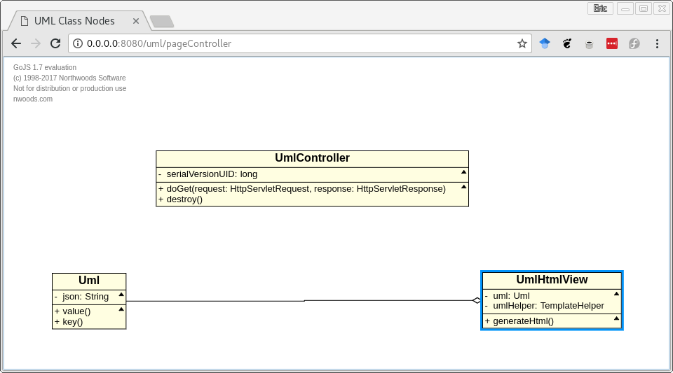
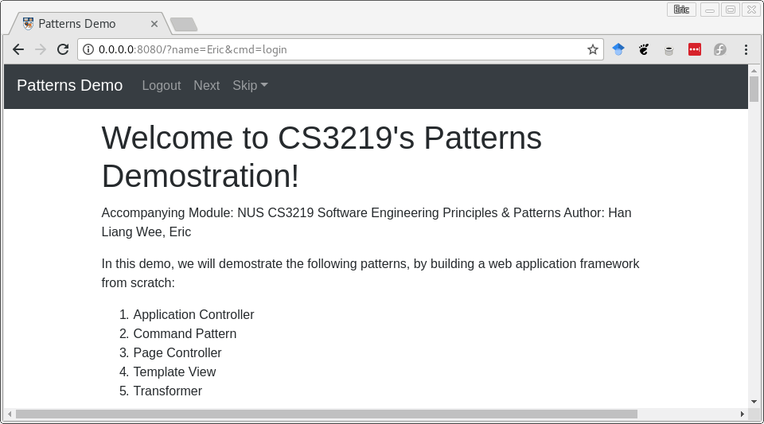

# Welcome to CS3219's Patterns Demostration! 

Accompanying Module: NUS CS3219 Software Engineering Principles & Patterns

Author: Han Liang Wee, Eric

In this demo, we will demostrate the following patterns, by building a web application framework from scratch:

1. Application Controller
1. Command Pattern
1. Page Controller
1. Template View
1. Transformer

The objective of this repository is to aid learning of software patterns through an interactive, interesting manner. The motivation of this project came from the lack of modern examples of patterns in teaching materials. The author has learnt much from implementing these patterns and hope that you will too by exploring this repository and even extending it.

We have used the aforementioned patterns in our implementation of this web application framework. In addition, to make learning interactive we have designed a tutorial using our web application fraomework and used the web application to document itself!

The tutorial web application consists of several pages. The first page is the home page and it will give a high level documentation of the design of our framework. In the subsequent pages, we will document each of the pattern(s) in the subsequent pages. In each of the pages, we will discuss the pattern, any relevant historical notes about the pattern, show and discuss our implementation(with UML diagram), some real life application that uses the pattern and lastly any textbook references to the pattern.

## ReadMe

We have packed the webapp with an embedded webserver plugin in maven. The <diagram> below shows the build process in our project. Maven will pack the code into a WAR file and then by running the [Jetty Maven Plugin](https://www.eclipse.org/jetty/documentation/9.4.x/jetty-maven-plugin.html), we are able to 'deploy' our WAR file into a temporary webserver([Jetty](https://www.eclipse.org/jetty/)). 

1. Ensure that all the required dependencies(Java and Maven) are installed on your machine
1. Navigate to the web application's root directory and simply execute `mvn jetty:run`. Maven will download all the required software dependencies and start the web application using Jetty as the web server.
1. Navigate to [http://0.0.0.0:8080/](http://0.0.0.0:8080/) and you should see the home page! If you can see the page, then congratulations! You have successfully run a webserver!

```
[INFO] --- jetty-maven-plugin:9.4.7.v20170914:run (default-cli) @ software-patterns-example ---
[INFO] Configuring Jetty for project: software-patterns-example Webapp
[INFO] webAppSourceDirectory not set. Trying src/main/webapp
[INFO] Reload Mechanic: automatic
[INFO] nonBlocking:false
[INFO] Classes = /home/Eric_Vader/workspace/cs3219r/target/classes
[INFO] Logging initialized @2499ms to org.eclipse.jetty.util.log.Slf4jLog
[INFO] Context path = /
[INFO] Tmp directory = /home/Eric_Vader/workspace/cs3219r/target/tmp
[INFO] Web defaults = org/eclipse/jetty/webapp/webdefault.xml
[INFO] Web overrides =  none
[INFO] web.xml file = file:///home/Eric_Vader/workspace/cs3219r/src/main/webapp/WEB-INF/web.xml
[INFO] Webapp directory = /home/Eric_Vader/workspace/cs3219r/src/main/webapp
[INFO] jetty-9.4.7.v20170914
[INFO] Scanning elapsed time=83ms
[INFO] DefaultSessionIdManager workerName=node0
[INFO] No SessionScavenger set, using defaults
[INFO] Scavenging every 660000ms
[INFO] Started o.e.j.m.p.JettyWebAppContext@460b6d54{/,file:///home/Eric_Vader/workspace/cs3219r/src/main/webapp/,AVAILABLE}{file:///home/Eric_Vader/workspace/cs3219r/src/main/webapp/}
[INFO] Started ServerConnector@2e388f7b{HTTP/1.1,[http/1.1]}{0.0.0.0:8080}
[INFO] Started @3594ms
[INFO] Started Jetty Server
```

### Software Dependencies

We have packaged the web application using maven and it also relies on Java. A summary of the software tools this application depend on and their respective versions are listed below:

 * Apache Maven 3.3.9: [Install Maven](https://maven.apache.org/install.html)
 * javac 1.8.0\_144: [Install Java](https://www.java.com/en/download/help/download_options.xml)

Detailed instructions on how to install the respective tools are given in the links above. To install these tools on [Fedora Linux](https://getfedora.org/en/workstation/download/), is simply `# dnf install maven`

#### Maven Dependencies

Our program is managed by Maven. It is a software dependency tool that allows us to easily manage our software dependencies. The maven dependencies(compile) and their corresponding versions(`$ mvn dependency:tree`) are listed below, they are accurate at the time of writing. We have included `junit` for the purpose of unit testing, however there are no test cases at the time of writing. The `javax.servlet` is a J2EE library that will be provided by the web server and it is not shipped with the war file. The `gson` library is used to marshall and unmarshall json objects, we will use that in the UML generation task, we will discuss more below. Lastly, we have chosen `commonmark` to convert markdown to html.

```bash
[INFO] sg.edu.nus.comp.cs3219r:software-patterns-example:war:0.0
[INFO] +- junit:junit:jar:3.8.1:test
[INFO] +- javax.servlet:javax.servlet-api:jar:3.1.0:provided
[INFO] +- com.google.code.gson:gson:jar:2.8.2:compile
[INFO] \- com.atlassian.commonmark:commonmark:jar:0.10.0:compile
```

#### Web Server Dependencies
We have chosen to use Jetty to be the web server to run the web application, as specified in our `pom.xml`. The web application should still run fine using any other web server that follows the JavaEE 3.0 Specifications as we did not rely on any Jetty specific libraries. We chose Jetty as it is convenient, allowing us to start our web application using maven directly.

```xml
<plugin>
	<groupId>org.eclipse.jetty</groupId>
	<artifactId>jetty-maven-plugin</artifactId>
	<version>${jettyVersion}</version>
	<configuration>
		<scanIntervalSeconds>2</scanIntervalSeconds>
	</configuration>
</plugin>
```

#### Frontend Dependencies

We have used several Html/Javascript/Css libraries to hasten development. These dependencies are common and are widely used in the industry. We have used the following:

1. Bootstrap: Used UI elements and CSS wireframe
	1. jquery
1. Go.js: Javascipt charting framework to draw the UML diagrams
	1. popper.js

The dependencies are already packaged into the web application and there is no need to install them.

## Web Application Architecture

In our framework and tutorial application, we have 3 independent parts as shown below. We can implement a web application using 2 different mechanisms, either page controller or application controller. In our implementation, page controller is used primariliy for resources that does not have state. application controller is used for applications that will require state management.

1. Standalone:
	1. UML Generator - Generates the UML diagram from code.
1. Web Applications:
	1. UML App - Shows the UML diagrams
	1. Tutorial App - Self-documenting the patterns used
	
### UML Generator

The code related to this component is located in the package `sg.edu.nus.comp.cs3219r.diagram`. We have designed a framework to read Java source code using Java Generics to produce UML diagrams. The motivation for this is that we want the web application to be a self-documenting tool for learning patterns. With that in mind, we want to allow users to modify code(pokeing around some patterns) and observe the effects of the code. We have designed the generation to be recursive and in levels:

1. `Diagram.java`: Starting point to parse a bunch of classes.
1. `Node.java`: Representing a class.
	1. `Method.java`: Generate the UML's methods
	1. `Parameter.java`: 
	1. `Property.java`
	1. `Visibility.java`
1. `Link.java`: Representing class relationship.
	1. `Relationship.java`

The rest of the 2 codes are `Utils.java` and `DiagramDirectory.java` which provide for some utlity function for the UML generation. The UML generation generates the UML diagrams from code and exports it to the directory `/src/main/webapp/uml/` as json files. The json files will be used by the UML App to be displayed to the end-user.

### UML App

The json files will be used by the UML application to display the UML diagrams to the user. The json files contain descriptors that will be used by the `go.js` charting library to draw the UML diagram. We had modified their code example to draw a nice UML diagram. This part of the application will use the front controller exclusively, which will also use the Template pattern to replace the json from the disk to plot the correct one based on the parameter from the path. An example of the UML diagram generated is at the path [http://0.0.0.0:8080/uml/pageController](http://0.0.0.0:8080/uml/pageController).



### Tutorial App

The tutorial application is the self-documenting application that is most interesting. The app is designed using the application controller pattern. Each action that the user performs will trigger a command on the application and that will be processed by the application controller. The command will perform actions on application state and when the application state has been updated then the view will be updated if necessary(Observer pattern). The view is processed using both template view and transformer and the output will be sent to the JavaEE servlet. 

There are 6 pages, one for each pattern and the last one is the home page. This is the home page that will give a brief description of the high level description. An example screenshot is given below. Explore the application by logging in and issue the commands on the nav bar.



## Web Application Structure

The web application framework is built ontop of JavaEE version 3.0. In this section, we will discuss how our web application is organized. Our framework is JavaEE 3.0 compliant, so the folder structure will follow JavaEE specifications. In addition, we used maven to manage our dependencies and we will also follow the Maven conventions for folder sturcture. The web application is found at the path `/src/main/webapp`. We have adopted a typical web application structure:

1. `css`: Stores all the web application's CSS files
1. `js`: Stores all the JS files
1. `markdown`: Markdown files, each file signify a page
1. `templates`: Templates for the webapplication
1. `uml`: Statically generated uml json
1. `WEB-INF`: J2EE specifications

```bash
.
├── css
│   ├── app.css
│   ├── bootstrap.css
│   ├── ...
│   └── bootstrap-reboot.min.css.map
├── js
│   ├── bootstrap.bundle.js
│   ├── ...
│   ├── bootstrap.min.js.map
│   ├── go-debug.d.ts
│   ├── ...
│   ├── go.js
│   ├── jquery-slim.min.js
│   └── popper.min.js
├── markdown
│   ├── appController.md
│   ├── ...
│   └── transform.md
├── templates
│   ├── tutorial.html
│   └── uml.html
├── uml
│   ├── pageController.json
│   ├── ...
│   └── uml.json
└── WEB-INF
    └── web.xml
```

## Further Work

There is much further work to be done with the application. For starters, the UML generation is not complete. The UML generation is missing the part that scans dependencies between classes. The current generator cannot draw a line if 1 object make a call to another. In the UML diagram defintion, there would be a line drawn between them. Secondly, more patterns can be added. We wanted to implement history using the momento pattern, we think that that will provide a meaningful and interesting learning experience.

